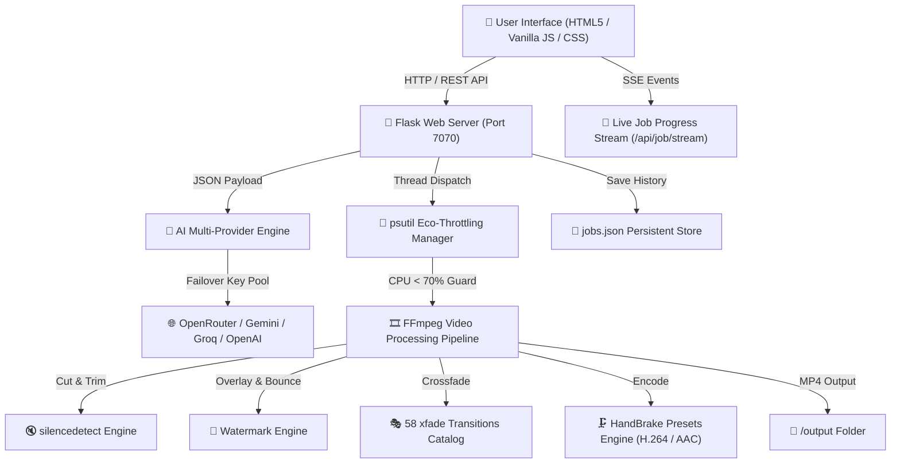

# 🏗️ WVideoFlow Architecture & Engineering Guide

## 📌 System Overview

**WVideoFlow** is an open-source, intelligent, web-based video editing engine designed for content creators and automated media workflows. It is optimized specifically to run on **low-to-mid tier hardware** without GPU acceleration.

---

## 🧩 Component Breakdown

### 1. Frontend Architecture (`templates/index.html`, `static/js/app.js`, `static/js/i18n.js`, `static/css/style.css`)
- **Single Page Application (SPA)**: Built with pure Vanilla HTML5, CSS3, and JavaScript (ES6+). Zero heavy frontend framework overhead.
- **Multilingual System (`i18n.js`)**: Dynamic runtime translation for English (LTR), Arabic (RTL), and French (LTR).
- **Auto-Saving State (`localStorage`)**: Saves user preferences continuously under `wv_settings` and `wv_ai_config`.
- **4-Step Guided Stepper UX**:
  1. **STEP 1**: Workflow Mode Selection (Master, Compression, Silence, Intro/Outro, Watermark, Slideshow).
  2. **STEP 2**: Media File Browsing & Scanning.
  3. **STEP 3**: AI Natural Language Prompt & Fine-Tuning.
  4. **STEP 4**: Processing & Real-Time SSE Log Monitor.

---

### 2. Backend & API Server (`app.py`)
- **Flask Server**: Runs on `http://localhost:7070` with multi-threaded request handling.
- **Server-Sent Events (SSE)**: Streams live rendering progress, elapsed time, current file, logs, and system CPU/RAM stats to the client.
- **Persistent Job Store**: Saves job history, execution logs, and output metadata to `jobs.json`.

---

### 3. Hardware Eco-Throttling Engine (`psutil`)
- **Dynamic Thread Capping**: Monitors CPU % and RAM % continuously.
- **Eco Mode (Max 70% CPU)**: If CPU or RAM load exceeds 70%, FFmpeg worker threads are capped (`-threads 1` or `2`) and micro-pauses (250ms) are injected between video cuts to prevent system freezes.

---

### 4. Multi-Provider AI Prompt Engine
- **Supported Providers**: OpenRouter, Google Gemini, Groq, OpenAI.
- **Multi-Key Pool Failover**: User can paste multiple API keys (one key per line). If Key #1 hits rate limits (429) or invalid auth (401), the engine automatically retries with Key #2..#N.
- **Prompt-to-JSON Parser**: Converts natural language requests into structured studio JSON parameters (mode, CRF, silence threshold, watermark opacity/position, transition duration, etc.).

---

### 5. Advanced FFmpeg Pipeline
- **Silence Trimming**: Uses `-af silencedetect=noise=-35dB:d=0.7s` to identify dead space and concatenates non-silent segments with lossless time adjustment.
- **HandBrake Presets**:
  - `Fast 720p HD`: `scale=-2:720`, `libx264`, `preset fast`, `CRF 23`.
  - `Very Fast 1080p`: `scale=-2:1080`, `libx264`, `preset veryfast`, `CRF 24`.
  - `Small File Size (Discord < 25MB)`: `scale=-2:480`, `libx264`, `CRF 28`.
- **Animated Bouncing Watermark**: Dynamically evaluates overlay position across corners using FFmpeg expressions:
  `overlay=(W-w)/2+(W-w-2*margin)/2*cos(t*0.5):(H-h)/2+(H-h-2*margin)/2*sin(t*0.5)`.
- **58 `xfade` Transitions**: Catalog covering basic fades, wipes, slides, smooth waves, geometric shapes, diagonal wipes, pixelization, and wind effects.

---

## 🔧 Developer Contact

- **Lead Maintainer**: WVideoFlow Team
- **Contact Email**: [wa2latia@gmail.com](mailto:wa2latia@gmail.com)
- **License**: MIT License
