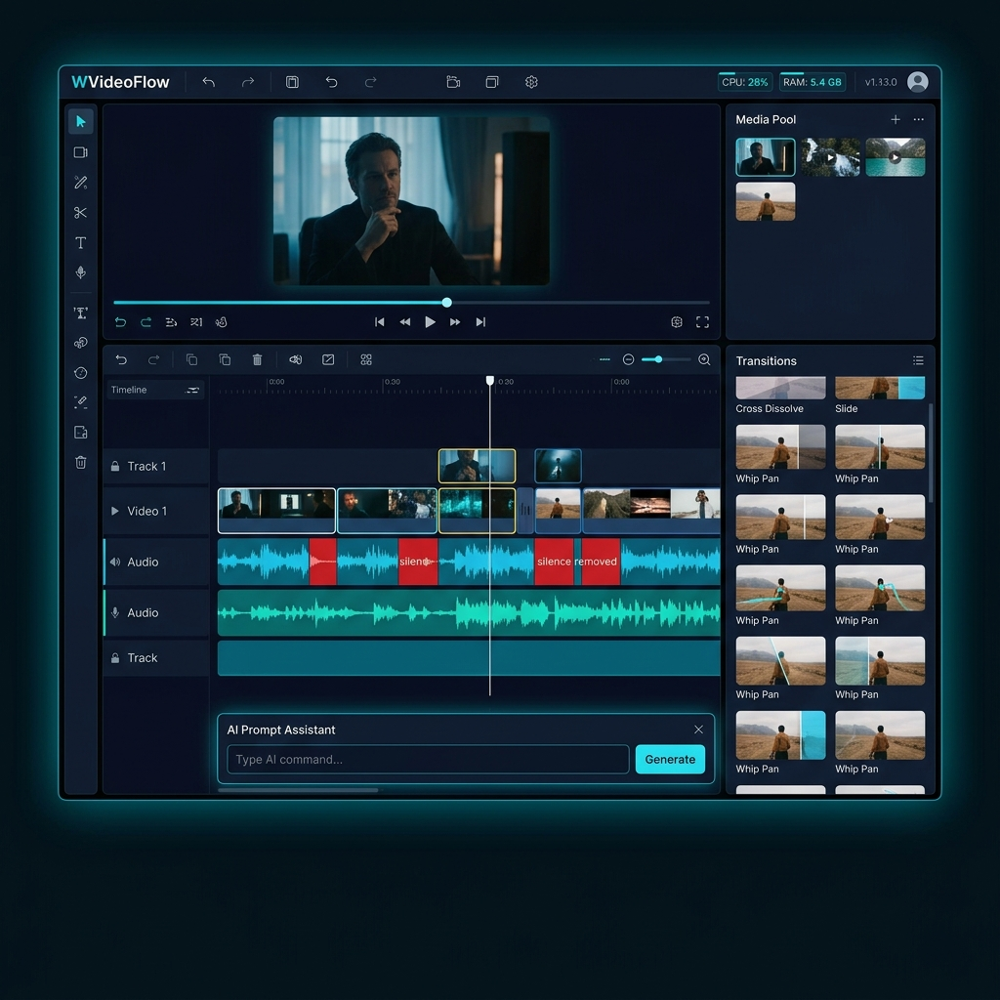
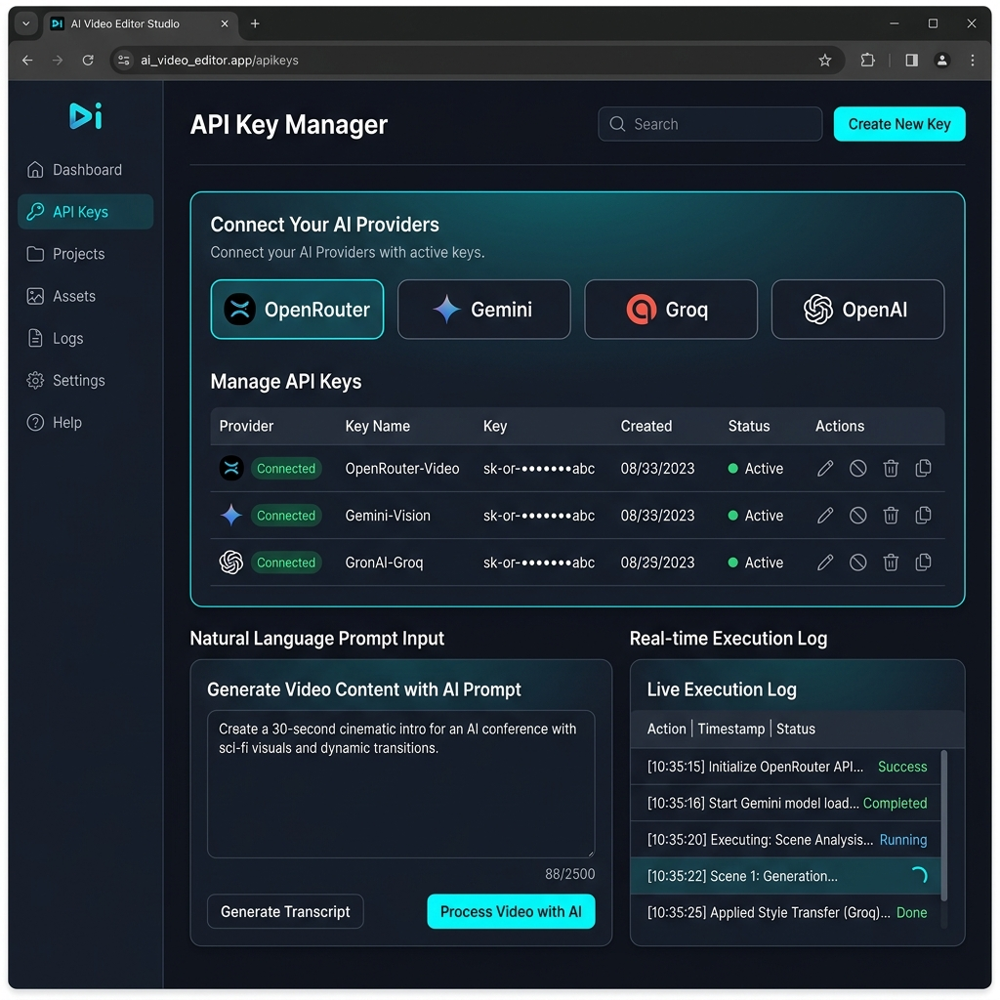

<div align="center">

# 🎬 WVideoFlow — Smart Video Auto Editor & Silence Remover

**High-Performance Batch Video Processing Optimized for Low & Mid-Spec Devices**

[](LICENSE)
[](https://python.org)
[](https://ffmpeg.org)
[](https://flask.palletsprojects.com)
[](#-zero-lag-hardware-optimization)
[](#-multilingual-support)

</div>

---

## 📌 Overview

**WVideoFlow** (دبليو فيديو فلو) is an open-source, intelligent, web-based video editing engine designed for content creators, educators, and video editors. It automates repetitive video editing tasks—such as **removing silence gaps**, **adding intros & outros**, **overlaying watermark logos**, and **applying smart transitions**—without requiring expensive commercial editing software or high-end GPUs.

WVideoFlow is specifically built to run smoothly on **weak and medium-tier hardware** (CPU-only systems), featuring an **adaptive resource throttling engine** that monitors CPU/RAM usage in real-time and prevents system freezing or overheating.

## 🖼️ Application Interface & Screenshots

<div align="center">
  
  <p><em>WVideoFlow Main Editing Interface — Timeline, Silence Waveform Trimming, Transitions Library & System Throttling Monitor</em></p>
  <br/>
  
  <p><em>AI Prompt-to-Edit Studio — Natural Language Prompting, Multi-Provider API Key Rotation & Live Execution Logs</em></p>
</div>

---

## 🏷️ GitHub Topics & SEO Tags

To maximize repository discoverability on GitHub, add the following topics to your repository settings (`About ⚙️ -> Topics`):

`video-editor` • `ffmpeg` • `ai-video-editor` • `silence-remover` • `flask` • `python` • `openrouter` • `gemini-api` • `groq` • `openai` • `handbrake` • `low-resource` • `multilingual` • `video-processing` • `video-editing-automation`

---

## 👤 Maintainer & Contact

- **Project Lead / Maintainer:** WVideoFlow Team
- **Contact Email:** [wa2latia@gmail.com](mailto:wa2latia@gmail.com)
- **License:** [MIT License](LICENSE)

---

## ✨ Key Features

| Feature | Description |
|---|---|
| 🤖 **AI Prompt-to-Edit Studio** | Natural language video editing powered by OpenRouter, Google Gemini, Groq, or OpenAI. |
| 🔑 **Multi-Key Pool Failover** | Paste multiple API keys per provider with automatic key rotation and failover upon rate limits. |
| 💡 **Smart Prompt Suggestions** | Pre-built prompt templates & dropdown presets for automated workflow configuration. |
| 🔇 **Smart Silence Removal** | Auto-detects and trims dead silence using FFmpeg's `silencedetect` with zero audio/video desync. |
| 🗜️ **HandBrake Presets** | Fast 720p, 1080p, and Discord/Email presets with custom CRF video quality control. |
| 🍃 **Low-Spec CPU Throttling** | Dynamic resource engine throttles thread count and adds micro-pauses when CPU/RAM exceeds 70%. |
| 🎭 **58 Smart Transitions** | Full interactive library of FFmpeg `xfade` transitions (wipes, dissolves, slides, wind, zooms) with live previews. |
| 🎬 **Seamless Intro / Outro** | Automatically rescales, normalizes, and welds intro/outro clips to your main videos. |
| 🔖 **Watermark & Logo Overlay** | Static corner overlay or dynamic animated bouncing watermark across all 4 screen corners. |
| 🖼️ **Photo Album Slideshow** | Turn image folders into continuous HD video slideshows with custom per-slide duration & audio track. |
| 🔗 **Persistent Background Execution** | Close your browser anytime; reopening the app automatically re-attaches to active background jobs. |
| 📁 **Recent Outputs Gallery** | Built-in output manager to preview, play, download, and manage completed videos. |
| 🌍 **Multilingual UI (EN / AR / FR)** | Instant toggle between English, Arabic (RTL support), and French interfaces. |

---

## 🍃 Zero-Lag Hardware Optimization

Traditional video processing tools push the CPU to 100% capacity, causing system lag, fan noise, or system freezes. **WVideoFlow** solves this with an **Adaptive Throttling Engine**:

- **Real-Time `psutil` Monitoring:** Continuously tracks system CPU % and RAM % load.
- **Eco Mode (Max 70% CPU):** Automatically caps FFmpeg threads and introduces adaptive pauses between cut segments if CPU/RAM load exceeds 70%.
- **Resource Profiles:**
  - `🍃 Eco / Low Specs`: Throttled max 70% CPU usage with micro-pauses (Ideal for dual-core/quad-core PCs).
  - `⚖️ Balanced`: Dynamic thread allocation for mid-range systems.
  - `⚡ High Performance`: Unrestricted multi-threading for powerful workstations.

---

## 🚀 Quick Start

### 1. Prerequisites

- **Python:** 3.8 or higher
- **FFmpeg:** Installed and added to system PATH

#### Install FFmpeg:
```bash
# Ubuntu / Debian
sudo apt update && sudo apt install -y ffmpeg python3-pip

# macOS (Homebrew)
brew install ffmpeg

# Windows (Chocolatey)
choco install ffmpeg
```

### 2. Installation

```bash
# Clone repository
git clone https://github.com/your-username/WVideoFlow.git
cd WVideoFlow

# Install Python requirements
pip install -r requirements.txt
```

### 3. Run Application

```bash
python3 app.py
```
Open your browser and navigate to: **`http://localhost:7070`**

---

## 🐳 Docker Deployment

You can run WVideoFlow in a lightweight Docker container:

```bash
# Build image
docker build -t wvideoflow .

# Run container
docker run -d -p 7070:7070 \
  -v $(pwd)/output:/app/output \
  -v $(pwd)/uploads:/app/uploads \
  --name wvideoflow_app wvideoflow
```

---

## ⚙️ Configuration & Options

| Setting | Default | Description |
|---|---|---|
| `SILENCE_THRESHOLD` | `-35 dB` | Audio level cutoff for silence detection |
| `MIN_SILENCE` | `0.7s` | Minimum duration of silence gap to trim |
| `SILENCE_PADDING` | `0.15s` | Audio padding retained around speech cuts |
| `RESOURCE_PROFILE` | `eco` | Hardware throttling mode (`eco`, `balanced`, `performance`) |
| `TRANSITION` | `fade` | Default transition effect ID |
| `TRANSITION_DURATION` | `0.6s` | Duration of xfade transition in seconds |
| `LOGO_POSITION` | `top_right` | Watermark placement (`top_left`, `top_right`, `bottom_left`, `bottom_right`, `center`) |

---

## 🗂️ Project Structure

```
WVideoFlow/
├── app.py                      ← Flask server, background worker & resource throttling engine
├── requirements.txt            ← Python dependencies (Flask, psutil)
├── Dockerfile                  ← Container setup
├── LICENSE                     ← MIT License
├── CONTRIBUTING.md             ← Contribution guidelines
├── README.md                   ← Documentation
├── .env.example                ← Environment variables template
├── .github/
│   ├── workflows/ci.yml        ← GitHub Actions CI pipeline
│   └── ISSUE_TEMPLATE/         ← Bug report & feature request templates
├── static/
│   ├── css/style.css           ← Dark design system & system monitor strip
│   ├── js/app.js               ← Frontend logic, SSE streaming, outputs gallery
│   ├── js/i18n.js              ← Translations (EN, AR, FR)
│   └── previews/               ← Pre-generated transition previews
├── templates/
│   └── index.html              ← Responsive SPA interface
├── uploads/                    ← Temporary file uploads (gitignored)
└── output/                     ← Rendered output videos & jobs.json history (gitignored)
```

---

## 🤝 Contributing

Contributions are welcome! Please check out [CONTRIBUTING.md](CONTRIBUTING.md) for guidelines on submitting pull requests or bug reports.

---

## 📄 License

Distributed under the **MIT License**. See [LICENSE](LICENSE) for more information.

<div align="center">
  Developed with ❤️ by the <strong>WVideoFlow Team</strong> · Contact: <a href="mailto:wa2latia@gmail.com">wa2latia@gmail.com</a>
</div>
